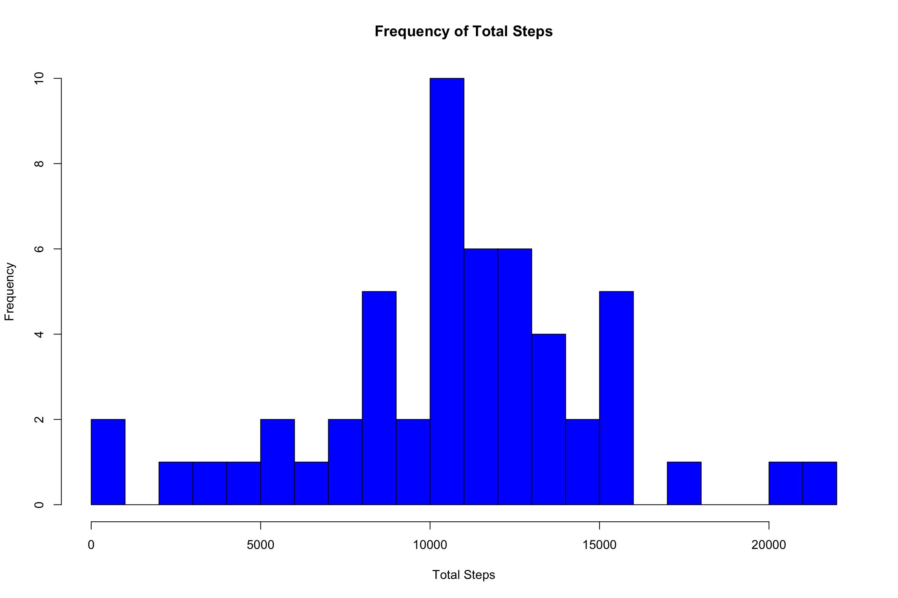
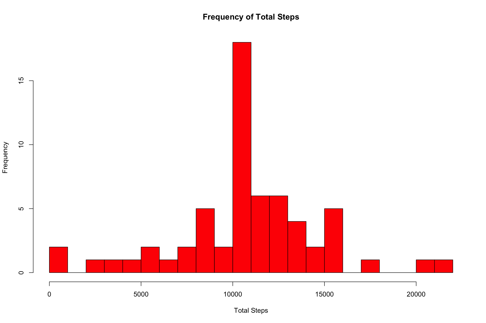
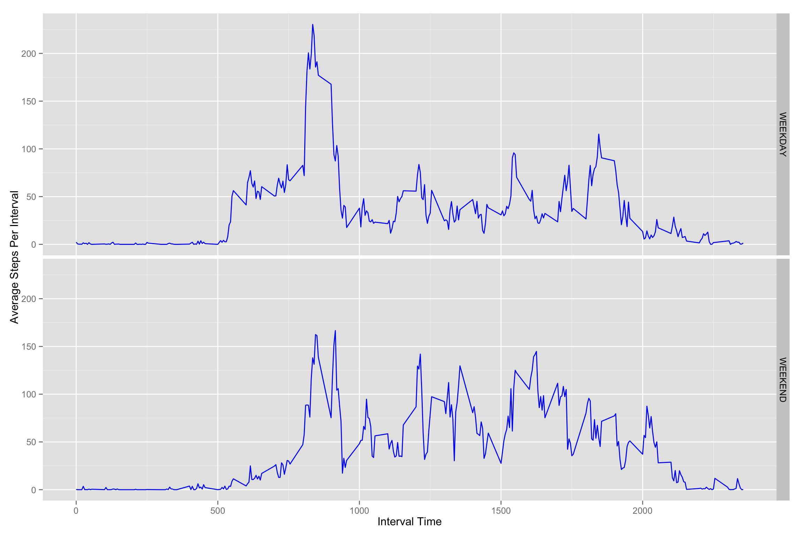

## Loading and preprocessing the data

The data for this assignment can be downloaded from this website.

  * DataSet: [Activity Monitoring Data](https://d396qusza40orc.cloudfront.net/repdata%2Fdata%2Factivity.zip) [52K]

To load the data

        1. Download from the aforementioned link.
        2. Unzip the file. File should be called "activity.csv".
        3. Read in the data in R, and store into object called activity_data
  

```r
activity_data <- read.csv("activity.csv")
```

Compute sum total of steps per day, taking into account the NAs. Transform data into data.frame for histogram plot. 


```r
activity_data_sum <- with(activity_data, tapply(steps, date, sum,    na.rm=F))
activity_data_sum <- as.data.frame(activity_data_sum)
activity_data_sum <- cbind(as.Date(rownames(activity_data_sum)), activity_data_sum)
rownames(activity_data_sum) <- seq(1,nrow(activity_data_sum))
names(activity_data_sum) <- c("Date", "Total_Steps")
```

Plot the histogram, which exhibits the frequency number of steps taken per day. Set number of breaks, n=30 to represent the number of days / month.


```r
hist(activity_data_sum$Total_Steps, col="blue", breaks=30, 
     main="Frequency of Total Steps", xlab="Total Steps")
```

 


## What is mean total number of steps taken per day?
The mean/median total number of steps taken per day is calculated by


The mean total number of steps taken per day is 1.0766 &times; 10<sup>4</sup>

The median total number of steps taken per day is 1.0765 &times; 10<sup>4</sup>.

## What is the average daily activity pattern?

Calculating the average daily activity pattern involves manipulating the data set and cleaning some entries, particularly the 
interval column. To accomplish this:

       1. Pad the interval column where needed to maintain consistent 4-digit width. The interval corresponds to the hour 
          [0000 - 2355] in the 24-hour military system.
       2. Create 'Date_Time' column and convert to POSIX using the function ymd_hm() from the lubridate library.
       3. Find the number of missing steps. This corresponds to NA entries in the data set. 
       4. Group by interval, select the columns - step, date, interval - and calculate the average number of steps per 
          interval. This will generate a table with all the average steps taken per interval time. 
                 

```r
activity_data_save <- activity_data
activity_data$interval <- str_pad(activity_data$interval, width=4, side="left", pad = "0")

activity_data <- (activity_data %>% mutate(Date_Time=ymd_hm(paste(date,interval), tz=Sys.timezone())))
num_of_missing_steps <- nrow(activity_data[is.na(activity_data$steps),])
```

The number of missing steps is 2304.


## Which 5-minute interval, on average across all the days in the dataset, contains the maximum number of steps?

Finally, create a new table, called activity, which contains the average number of steps taken per interval. This is 
accomplished by: 

```r
activity <- (activity_data %>% group_by(interval)
                           %>% select(steps, date, interval) 
                           %>% summarize(avgStepsPerInterval= mean(steps, na.rm=T)))
```


The interval with maximum average number of steps is 0835 with average number of steps at
206.


## Imputing missing values

To impute missing values, scan the data for "NA" steps, and replace the missing data with the calculated average steps per interval, as computed above.


```r
 for (r in c(1:nrow(activity_data)) ) {
  if (is.na(activity_data$steps[r]) ) {
      rth_interval <- activity_data$interval[r]
      activity_data$steps[r] <- activity[activity$interval==rth_interval,]$avgStepsPerInterval
  }
}
```

Compute the daily total steps and calculate the mean/median.

```r
imputed_activity_data_sum <- round(with(activity_data, tapply(steps, date, sum,    na.rm=F)))

imputed_meanSteps   <- mean(imputed_activity_data_sum)
imputed_medianSteps <- median(imputed_activity_data_sum)
```

```r
imputed_meanSteps
```

[1] 10766.16

```r
imputed_medianSteps
```

[1] 10766

Convert the table into a data.frame for the histogram plots.

```r
imputed_activity_data_sum <- as.data.frame(imputed_activity_data_sum)
imputed_activity_data_sum <- cbind(as.Date(rownames(imputed_activity_data_sum)), imputed_activity_data_sum)
rownames(imputed_activity_data_sum) <- seq(1,nrow(imputed_activity_data_sum))
names(imputed_activity_data_sum) <- c("Date", "Total_Steps")
```

Here is a table of the imputed data:

```r
head(imputed_activity_data_sum, n=20)
```

```
##          Date Total_Steps
## 1  2012-10-01       10766
## 2  2012-10-02         126
## 3  2012-10-03       11352
## 4  2012-10-04       12116
## 5  2012-10-05       13294
## 6  2012-10-06       15420
## 7  2012-10-07       11015
## 8  2012-10-08       10766
## 9  2012-10-09       12811
## 10 2012-10-10        9900
## 11 2012-10-11       10304
## 12 2012-10-12       17382
## 13 2012-10-13       12426
## 14 2012-10-14       15098
## 15 2012-10-15       10139
## 16 2012-10-16       15084
## 17 2012-10-17       13452
## 18 2012-10-18       10056
## 19 2012-10-19       11829
## 20 2012-10-20       10395
```

Here is the new histogram with the imputed data.


```r
hist(imputed_activity_data_sum$Total_Steps, col="red", breaks=30,
     main="Frequency of Total Steps", xlab="Total Steps")
```

 

Create a new column to indicate Weekday/Weekend. This will allow calculating the average steps per Interval grouped by weekday/weekend.

```r
activity_data <- (activity_data %>% mutate(Day=weekdays(Date_Time)))
activity_data <- (activity_data %>% mutate(Weekdays=ifelse( (Day %in% c("Saturday", "Sunday")), "WEEKEND", "WEEKDAY")))

imputed_activity <- (activity_data %>% group_by(Weekdays, interval)
                                   %>% select(steps, date, interval, Weekdays) 
                                   %>% summarize(avgStepsPerInterval= mean(steps)))
```

## Are there differences in activity patterns between weekdays and weekends?

Plot the imputed_activity table and display the results based on the Weekday/Weekend. 


```r
p <- ggplot(imputed_activity, aes(x=as.numeric(interval), y=avgStepsPerInterval)) +
     facet_grid(Weekdays~.) + geom_line(colour="blue") +
     xlab("Interval Time")  + ylab("Average Steps Per Interval")
p
```

 


## Conclusion

There is a difference in activity levels between weekday and weekend. The **greatest spike** is during the weekday morning, possibly when the individuals are commuting to work or exercising. The weekend activity showed more consistent averages throughout the day. The greatest spike on the *weekends* was also in the morning, indicating possible routine exercise being 
performed. No activity was seen during night hours, where individual may be sleeping or sendentary.

